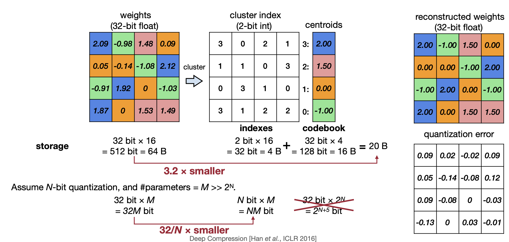

## 1.1：我们为什么需要量化（Why）
为什么要做量化（量化的意义是什么），然后讲量化的基本原理是什么，以及量化的分类（PTQ和QAT，weight-only 和 weight-act），原理讲解+基本原理代码。

### 1.1.0 前言：为什么做量化（或者说模型压缩）
举个🌰：
小明想跑一个30G的模型，但是他的显存只有10G，怎么办？一时间小明陷入了沉思。突然他想到了去餐厅吃小龙虾饭打包，小明剩了20个龙虾，但打包盒只能装10个，怎么办呢，小明灵机一动，剥头去尾，这样就可以把20个龙虾打包了。类似的方法能不能在这里实现呢，比如把参数存储的类型从float32变成int8，这样就可以把30G的模型压缩到10G，这样就可以在显存只有10G的设备上跑30G的模型了。

而这就是模型量化的思想了，通过改变参数存储的类型（从较大比特的存储方式转化为较小比特的存储方式），实现模型大小的压缩，从而实现模型在显存较小的设备上跑大模型。

所有大模型量化（或者说模型压缩）是一种重要的优化技术，其目的主要在于减少深度学习模型的内存占用、提高推理速度，同时尽量保持模型的精度。以下是进行大模型量化的主要原因：
大模型量化是一种优化技术，旨在减少深度学习模型的内存占用和提高推理速度，同时尽量保持模型的精度。这一技术对于当前大规模、高复杂度的深度学习模型来说尤为重要，其意义主要体现在以下几个方面：

1. **减少内存占用**：量化后的模型权重和激活值占用更少的内存，深度学习模型，尤其是大型语言模型，通常拥有数亿到数千亿个参数。这些参数如果以32位浮点数（FP32）表示，会占用大量的内存空间。通过量化技术，可以将这些参数从FP32压缩到16位、8位甚至4位，从而显著减少内存占用，从而可以在有限的硬件资源上部署更大的模型，这对于在存储空间受限的设备上部署模型尤为重要。例如，将BERT模型从FP32量化到INT8可以将模型大小减少到原来的四分之一，同时保持较高的推理精度。
2. **提高推理速度**：量化技术将浮点数运算转换为整型运算，在一些硬件平台上，如移动设备、嵌入式设备或特定的加速器（如TPU、FPGA等），整数计算比浮点计算要快得多。通过量化，将浮点数表示的权重和激活值转换为整数，可以加速计算过程，提升推理速度。这对于需要快速响应的应用场景非常有利，能够显著减少模型的计算时间。在硬件层面，许多现代处理器和加速器都支持低精度运算，进一步提高了量化模型的性能。
3. **降低功耗**：量化后的模型在推理过程中消耗的能量更少，更快的计算速度和更小的内存占用通常意味着更低的能耗。在低功耗设备上（如手机或嵌入式系统），通过使用量化模型可以减少计算时的能耗，延长设备电池续航时间，这对于移动设备、嵌入式系统等资源受限的环境尤为重要。
4. **便于模型部署**：量化技术使得深度学习模型更容易在资源受限的设备上部署和运行，因此可以降低在云端或边缘设备上的部署和运行成本，推动了人工智能技术在更多场景中的应用。

### 1.1.1 什么是模型量化
首先，什么是量化？

1. **定义**：量化（Quantization）是指将连续值或高精度数值映射到一组离散值或低精度数值的过程。在深度学习中，量化通常涉及将32位浮点数（FP32）转换为较低精度的表示形式，如16位浮点数（FP16）、8位整数（INT8）或4位整数（INT4）。

大模型量化是一种模型压缩和优化技术，旨在减少深度学习模型的内存占用和提高推理速度，同时尽量保持模型的精度。量化后的模型权重占用更少的内存，从而可以在有限的硬件资源上部署更大的模型。而模型的压缩方法有很多，比如剪枝、量化、知识蒸馏，低秩分解等，这些方法都可以在一定程度上降低模型的参数量，从而减小模型的体积，提高模型的推理速度，降低模型的能耗。但是，这些方法在压缩模型的同时，也会带来一些问题，比如模型的精度下降、模型的推理速度不稳定等。首先我们从感性上来介绍几种不同方法的差异性：


如上图所示，大家可以很好的了解不同压缩方法的差异性了，首先，
1）量化，是通过降低模型中参数的精度，从而减小模型的体积，从图像来说就是把原先的高分辨率的彩图，变成了低分辨率，但整体图片的大小是没变的。这其实意味着模型的参数量是没变的，变化的只是每个参数的粒度，就像一个文件夹里面有100个txt文档，每个文档大小为10M，量化就是保持原始的文件数量还是100个，但把每个文件大小降低为1M，这样总的文件夹大小就降低了。
2）剪枝，则是在保持模型精度不变的情况下，把模型中的部分参数删除，从而减小模型的体积，从图像上来说就是删掉了某些不重要的局部信息。这种情况下模型的参数量就变了，比如从100个txt文件，删掉了一些文件，变成了80个，但每个的大小都还是10M。
3）知识蒸馏，则是通过训练一个小的模型，使其学习一个大模型的特征，从而减小模型的体积。从图像上来说就是做了一个小的类似的东西。这种意味着参考之前的文件夹，再重新建了一个文件夹，然后用10个新的txt文件，每个文档大小为10M，实现了和之前一样的功能，虽然他们完全不一样
4）低秩分解，则是通过将模型的参数分解为低秩矩阵，从而减小模型的体积。（这个图像不好说，可以参考看SVD），这种意味着我把文件夹里面的100个txt文件，分解为了3个其他文件，然后每个文件和原始的不同（并且每个只有10K到20M不等），但文件组合起来能基本恢复100个txt文件（这里可能有点抽象，详细内容大家可以去看矩阵论的SVD分解，会有更为清晰的认识）。

### 1.1.2 量化参数与算法

（1）**量化粒度**

量化粒度决定了量化的细粒度。量化粒度决定了量化的细粒度。常见的量化粒度包括逐层量化（per-tensor）、逐通道量化（per-channel或vector-wise quantization）和逐组量化（per-group或Group-wise）。逐通道量化通常能获得更好的精度，因为它对每个通道分别进行量化，可以更好地适应不同通道的权重分布。然而，逐通道量化可能需要更多的计算资源。逐层量化和逐张量量化更简单且计算效率更高，但可能会引入较大的精度损失。

- **逐层量化**：以一层网络为量化单位，每层网络一组量化参数。这种方法最简单，但可能会引入较大的精度损失。
- **逐通道量化**：以一层网络的每个量化通道为单位，每个通道单独使用一组量化参数。逐通道量化由于量化粒度更细，能获得更高的量化精度，但计算也更复杂。
- **逐组量化**：以组为单位，每个组使用一组量化参数。其粒度处于逐层量化和逐通道量化之间。

（2）**量化算法**

量化算法决定了如何将浮点数映射到低精度表示。常见的量化算法包括线性量化（如对称量化和非对称量化）和非线性量化（如对数量化）。

- **线性量化**：假设量化前的浮点数r和量化后的整数q之间存在线性关系，即q = clip(round(r/s + z), q_min, q_max)。其中，s是数据量化的间隔，z是表示数据偏移的偏置。线性量化简单且计算效率高，但可能无法充分利用数据分布的特性。
  	* **对称量化**：浮点值的零点直接映射到量化值的零点，因此不需要其他参数来调整零点的映射位置，与量化相关的参数只有缩放因子s。
	* **非对称量化**：有一个额外的参数Z调整零点的映射，这个参数通常称为零点。非对称量化表示的范围没有严格的限制，可以根据浮点值的范围选取任意的表示范围。因此非对称量化的效果通常比对称量化好，但是需要额外存储以及推理时计算零点相关的内容。
- **非线性量化**：根据量化数据表示的原始数据范围是否均匀，将量化方法分为线性量化和非线性量化。非线性量化可以根据数据分布的特性进行更精细的量化，但计算复杂度较高。


### 1.1.3 量化方法与技术

量化技术是一种有效的模型压缩手段，它能够将深度学习模型中的浮点数转换为整数或其他离散形式，从而显著降低模型的存储和计算负担。模型量化的核心思想是利用数学变换和编码技术，将浮点数的存储和运算转换为整数的存储和运算。具体来说，量化过程包括两个主要步骤：前向量化和反向量化。

1. **前向量化**：将浮点数转换为整数的过程。在这个过程中，将浮点数的范围映射到一个整数范围内，并将浮点数转换为对应的整数。这个映射过程通常是通过一个缩放因子和一个偏移量来实现的。缩放因子用于调整整数的范围，使其能够覆盖浮点数的范围；偏移量则用于将浮点数的零点映射到整数的零点。

   前向量化的数学表达式可以表示为：
   q = clip(round(r/s + z), q_min, q_max)
   其中，r表示量化前的浮点数，q表示量化后的整数，s是数据量化的间隔，z是表示数据偏移的偏置，q_min和q_max是量化后的最小值和最大值。round()和clip()分别表示取整和截断操作。

2. **反向量化**：将整数转换回浮点数的过程。这个过程是前向量化的逆操作，用于在推理过程中将整数还原为浮点数，以便进行后续的运算。

   反向量化的数学表达式可以表示为：
   r' = s * (q - z)
   其中，r'表示还原后的浮点数，q表示量化后的整数，s和z分别是量化时的缩放因子和偏移量。

大模型量化可以根据不同的标准进行分类，常见的分类方式包括训练过程中的量化方式（PTQ和QAT）、量化对象（weight-only和weight-act）等。

#### 1）训练过程中的量化方式

我们依据是否要对量化后的参数进行调整，我们可以将量化方法分为量化感知训练（QAT）和训练后量化（PTQ）两种。 这两种方法的操作区别如下图所示（图左为QAT，图右为PTQ）：


量化感知训练 QAT 是将训练过的模型量化后又再进行重训练。由于定点数值无法用于反向梯度计算，实际操作过程是在某些op前插入伪量化节点（fake quantization nodes）， 用于在训练时获取流经该op的数据的截断值，便于在部署量化模型时对节点进行量化时使用。我们需要在训练中通过不断优化精度来获取最佳的量化参数。由于它需要对模型进行训练, 对操作人员技术要求较高。

训练后量化 PTQ 是使用一批校准数据对训练好的模型进行校准, 将训练过的FP32网络直接转换为定点计算的网络，过程中无需对原始模型进行任何训练。只对几个超参数调整就可完成量化过程, 且过程简单快速, 无需训练, 因此此方法已被广泛应用于大量的端侧和云侧部署场景，我们优先推荐您尝试PTQ方法来查看是否满足您的部署精度和性能要求。

（1）**训练后量化（Post-Training Quantization, PTQ）**

PTQ是在模型训练完成后对其参数进行量化，只需要少量校准数据，适用于追求高易用性和缺乏训练资源的场景。其主要目标是减少模型的存储和计算复杂性，而无需对模型架构进行修改或进行重新训练。PTQ的主要优势在于其简单性和高效性，但可能会在量化过程中引入一定程度的精度损失。

量化感知训练（QAT）是一种在模型训练过程中就考虑量化影响的技术。它的核心思想是将量化目标无缝地集成到模型的训练过程中，使模型在训练阶段就能够适应低精度表示，从而减少量化后可能带来的精度损失。

1. **定义与原理**：

	* 在QAT中，模型训练过程中会加入量化感知节点，这些节点可以模拟量化带来的误差，并将其反馈给训练过程。
	* 通过这种方式，模型在训练过程中就能够学习到如何适应量化后的低精度表示，从而保持较高的性能。

2. **实施步骤**：

	* 定义一个浮点模型作为基线模型。
	* 定义一个与基线模型结构相同但增加了量化操作和反量化操作的量化模型。
	* 在训练过程中，使用量化模型进行正向和反向传递，并在每个训练周期或批次结束时使用反量化操作计算精度损失。
	* 通过调整模型参数和量化参数，使量化模型在保持较高性能的同时逐渐适应低精度表示。
	* 训练结束后，使用微调技术进一步提高模型的准确率。

3. **优势**：

	* 能够在量化过程中保持较高的模型性能。
	* 适用于对精度要求较高的场景。

PTQ的具体流程通常包括以下几个步骤：

- **数据收集**：收集用于校准的代表性数据集。
- **量化参数确定**：根据校准数据集确定量化参数，如缩放因子和偏移量。
- **模型量化**：将模型权重和激活值按照量化参数进行转换。
- **模型验证**：在验证数据集上评估量化后模型的性能，确保精度损失在可接受范围内。

（2）**量化感知训练（Quantization Aware Training, QAT）**

QAT是在模型训练过程中加入伪量化算子，通过训练时统计输入输出的数据范围来提升量化后模型的精度。这种方法适用于对模型精度要求较高的场景。

训练后量化（PTQ）是在模型训练完成后对其进行量化的技术。它的主要目标是减少模型的存储和计算复杂性，而无需对模型架构进行修改或进行重新训练。由于无需复杂的fine-tuning或训练过程，因此开销较小。训练后量化可以分为权重量化和全量化两种。
+ **权重量化**：仅对模型的权重进行量化操作，以整型形式存储模型权重，可以压缩模型的大小。在推理阶段首先将量化的权重反量化为浮点形式，推理过程仍然为浮点计算，无法加速推理过程。
+ **全量化**：对模型权重和激活值进行量化，不仅可以压缩模型大小，减少推理过程的内存占用，而且因为激活值和权重都为整型数据，因此可以使用高效的整型运算单元加速推理过程。全量化可以分为静态量化和动态量化两种。
    + **静态量化**：离线计算好模型权重和激活的量化参数，推理的时候不再调整直接使用。
    + **动态量化**：激活值相关的量化参数是在推理阶段实时计算的。虽然效果更好，但是会给推理带来额外的开销。

1. **定义与原理**：

	* PTQ涉及在模型训练阶段完成后，使用量化工具对模型的参数和权重进行量化。
	* 量化过程通常包括将浮点数转换为低精度格式（如int8或float16）。

2. **实施步骤**：

	* 使用浮点格式训练模型并获得训练好的模型。
	* 使用量化工具对模型进行量化，将模型的参数和权重转换为低精度格式。
	* 评估量化模型的精度和性能，并进行必要的调整。
	* 将量化模型部署到目标平台。

3. **优势与局限性**：

	* 优势：PTQ具有简单性和高效性的优点，能够快速实现模型压缩。
	* 局限性：由于PTQ是在模型训练完成后进行的量化，因此可能会引入一定程度的精度损失。这需要在量化过程中进行权衡和调整。

QAT的具体流程通常包括以下几个步骤：

- **模型初始化**：设置模型的初始权重和量化参数。
- **伪量化**：在训练过程中，对每个前向传播步骤应用伪量化算子，将浮点数转换为整数并再转换回浮点数（即模拟量化过程）。
- **损失计算**：计算模型在伪量化后的损失。
- **参数更新**：根据损失函数对模型权重进行更新。
- **模型验证**：在验证数据集上评估模型性能，并根据需要调整量化参数。
- **模型导出**：在训练完成后，导出量化后的模型。

QAT通过模拟量化过程，使模型在训练过程中适应低精度表示，从而增强了其处理由量化引起的精度损失的能力。

#### 2）量化对象

（1）**仅权重量化（Weight-Only Quantization）**

仅权重量化是指仅对模型的权重进行量化，而保持激活值为浮点数。这种方法相对简单，但可能无法充分利用量化带来的性能提升。因为在实际应用中，激活值往往占内存使用的大头，量化激活值可以进一步减少内存占用和提高推理速度。

（2）**权重和激活量化（Weight-and-Activation Quantization）**

权重和激活量化是指同时对模型的权重和激活值进行量化。这种方法能够更全面地利用量化技术带来的优势，但也可能引入更大的精度损失。因此，在量化过程中需要仔细调整量化参数和量化策略，以确保在保持模型精度的同时最大化性能提升。


### 1.1.4 应用场景与挑战

1. **应用场景**：大模型量化的应用场景主要涉及嵌入式设备、移动设备、物联网设备和边缘计算等。在这些场景中，模型的大小和推理速度是关键因素，而量化技术可以有效地解决这些问题。例如，在自动驾驶系统中，实时性要求非常高，而量化技术可以显著提高推理速度；在手机或智能摄像头等嵌入式设备中，量化技术可以减小模型尺寸，使其更易于部署和运行。
2. **挑战**：大模型量化也面临一些挑战，如量化的精度损失、量化过程中的模型稳定性问题以及量化技术需要考虑硬件设备的支持和兼容性问题等。为了克服这些挑战，研究者们正在不断探索新的技术和方法，如使用混合精度量化技术、开发针对特定硬件设备的优化算法等。

可能有部分小伙伴对量化的概念中所提到的线性映射和舍入操作不太清楚，也量化有所误解，认为量化就是将浮点数转换为整数，其实不然，量化不仅仅是简单的浮点数到整数的转换，还包括了线性映射和舍入操作，下面我们通过一个简单的例子来理解量化。




### 1.1.5 基本原理代码示例

以下是一个简单的Python代码示例，用于演示如何进行大模型量化。该示例使用了PyTorch框架和FakeQuantize模块来模拟量化过程。

```python
import torch
import torch.nn as nn
import torch.nn.functional as F
import torchvision.models as models

# 定义一个简单的卷积神经网络模型
class SimpleCNN(nn.Module):
    def __init__(self):
        super(SimpleCNN, self).__init__()
        self.conv1 = nn.Conv2d(3, 16, 3, padding=1)
        self.conv2 = nn.Conv2d(16, 32, 3, padding=1)
        self.fc1 = nn.Linear(32 * 8 * 8, 128)  # 假设输入图像大小为32x32
        self.fc2 = nn.Linear(128, 10)

    def forward(self, x):
        x = F.relu(self.conv1(x))
        x = F.max_pool2d(x, 2)
        x = F.relu(self.conv2(x))
        x = F.max_pool2d(x, 2)
        x = x.view(x.size(0), -1)
        x = F.relu(self.fc1(x))
        x = self.fc2(x)
        return x

# 加载预训练的模型
model = SimpleCNN()
# 假设已经对模型进行了训练，这里省略训练过程

# 定义量化参数
scale = 0.02
zero_point = 128
dtype = torch.qint8

# 对模型进行量化
class QuantizedSimpleCNN(nn.Module):
    def __init__(self, original_model):
        super(QuantizedSimpleCNN, self).__init__()
        self.conv1 = nn.quantized.Conv2d(
            original_model.conv1.in_channels,
            original_model.conv1.out_channels,
            original_model.conv1.kernel_size,
            original_model.conv1.stride,
            original_model.conv1.padding,
            original_model.conv1.dilation,
            original_model.conv1.groups,
            bias=original_model.conv1.bias is not None,
            dtype=dtype
        )
        self.conv2 = nn.quantized.Conv2d(
            original_model.conv2.in_channels,
            original_model.conv2.out_channels,
            original_model.conv2.kernel_size,
            original_model.conv2.stride,
            original_model.conv2.padding,
            original_model.conv2.dilation,
            original_model.conv2.groups,
            bias=original_model.conv2.bias is not None,
            dtype=dtype
        )
        self.fc1 = nn.quantized.Linear(
            original_model.fc1.in_features,
            original_model.fc1.out_features,
            dtype=dtype
        )
        self.fc2 = nn.quantized.Linear(
            original_model.fc2.in_features,
            original_model.fc2.out_features,
            dtype=dtype
        )
        # 注意：在实际应用中，通常需要使用torch.quantization.prepare和torch.quantization.convert函数
        # 来准备和转换模型，这里为了简化直接手动创建了量化层。

    def forward(self, x):
        x = torch.quantization.quantize(x, scale=scale, zero_point=zero_point, dtype=dtype)
        x = F.relu(self.conv1(x))
        x = F.max_pool2d(x, 2)
        x = F.relu(self.conv2(x))
        x = F.max_pool2d(x, 2)
        x = x.view(x.size(0), -1)
        x = F.relu(self.fc1(x))
        x = self.fc2(x)
        # 注意：这里需要反量化回浮点数以便后续处理或评估，但在实际应用中，
        # 量化模型的输出通常直接用于后续的低精度计算或存储。
        x = torch.quantization.dequantize(x)
        return x

# 注意：上面的QuantizedSimpleCNN类是一个简化的示例，实际中量化模型的创建和转换过程
# 要复杂得多，通常需要使用PyTorch的量化工具包（如torch.quantization）来完成。
# 下面是一个更贴近实际使用的量化流程示例：

# 准备模型进行量化
model.qconfig = torch.quantization.get_default_qconfig('fbgemm')  # 选择后端和量化配置
model.prepare_qconfig()  # 准备量化配置

# 校准模型（这一步在PTQ中是必需的，用于收集激活值的统计信息）
# 通常需要用一个代表性的数据集来运行模型，以便收集量化所需的统计信息。
# 这里省略具体代码，因为实际校准过程可能涉及数据加载、模型推理等步骤。

# 转换模型为量化模型
model_quantized = torch.quantization.convert(model, inplace=False)

# 现在model_quantized是一个量化后的模型，可以像普通模型一样进行推理。
# 请注意，在实际应用中，量化模型的推理过程通常涉及低精度计算或存储，
# 因此可能需要在支持低精度运算的硬件上运行才能获得最佳性能。

# 示例：使用量化模型进行推理
# input_tensor = ...  # 加载或创建输入张量
# output_tensor = model_quantized(input_tensor)  # 进行推理
```

**注意**：上面的代码示例中，`QuantizedSimpleCNN` 类和量化流程的描述是为了展示量化的基本原理和步骤，并不是一个可以直接运行的完整示例。在实际应用中，量化模型的创建和转换通常需要使用 PyTorch 提供的量化工具包（如 `torch.quantization`）来完成，并且需要仔细调整量化参数和策略以确保量化后的模型具有可接受的精度和性能。

此外，上面的代码示例中使用了 `torch.quantization.quantize` 和 `torch.quantization.dequantize` 函数来模拟量化和反量化过程，但在实际应用中，这些操作通常由量化框架在内部自动处理。在量化模型的推理过程中，通常不需要显式地进行反量化操作，因为量化模型的输出通常直接用于后续的低精度计算或存储。

最后，需要注意的是，量化模型的精度和性能取决于多种因素，包括量化策略、量化粒度、量化参数、校准数据的质量等。因此，在进行量化时，需要仔细调整这些因素，并通过实验来找到最佳的量化配置。